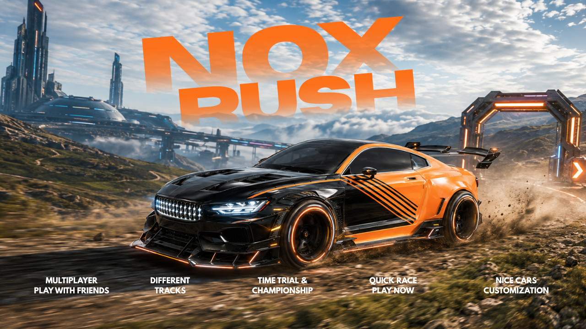

# NOXRUSH



A browser-based LAN arcade racer — smooth antialiased 3D (no pixel art), three
circuits (coastal, alpine, desert), ten adaptive AI opponents, and a
festival-style HUD with skill chains.

Runs entirely on your machine. Your friend joins from their own browser over
your local network — no accounts, no internet, no build step.

## Running it

From the repo directory:

```bash
npm install
```

```bash
npm start
```

The server prints the two addresses you need:

```
Local:   http://localhost:4300
Friend:  http://192.168.1.24:4300
```

Open the local address yourself, send your friend the `Friend:` one. The lobby
also shows that address so you can read it off the screen.

Enter a name and pick a paint colour — your car is sitting on the track beside
the menu and repaints as you choose, so you can see what you're driving before
you commit to it.

Pick a track — **Coastal Circuit** (seaside sweepers), **Alpine Ridge** (tight
misty esses) or **Sunset Speedway** (flat-out desert) — each in **forward or
reversed** direction, six layouts in all. The world behind the menu switches to
your pick immediately. In a FRIENDS race, the first driver to hit READY picks
the track for everyone.

In a hurry? **⚡ QUICK RACE** on any step drops you straight onto the grid
against the rivals.

Then pick who you're racing:

| Race against | Grid | Starts when |
| --- | --- | --- |
| **BOTS** | You plus eleven rivals | The moment *you* hit READY |
| **FRIENDS** | Only the drivers on your LAN, no AI | Everyone in your group is ready |
| **TIME TRIAL** | Just you — and the ghost of your best lap | Instantly |
| **CHAMPIONSHIP** | Three-race series vs the rivals, F1-style points | Instantly |

**TIME TRIAL** replays your fastest lap as a translucent ghost car that
relaunches with you at every line crossing — beat it and the new lap becomes
the ghost. **CHAMPIONSHIP** runs Coastal → Alpine → Sunset (in your chosen
direction) with points per finish; the series pays a big XP bonus. There's
also a **📅 DAILY CHALLENGE** on the RACE step — a date-seeded track combo,
same for everyone that day, with bonus XP for your first run. And the
rivals **rubber-band gently** (±6% of top speed, never their cornering), so
the pack stays contested without ever being unbeatable.

When a server is running it also keeps **track records** — the all-time top
ten laps per circuit, persisted across restarts in `data/records.json` and
shown on the TRACK step. Passing a rival calls it out in the skill feed (and
pays XP); losing a place gets called too.

**BOTS** never waits for anyone, so a friend who is still choosing a colour — or a
browser tab someone forgot about — can't hold you up. Humans start at the back of
the AI grid so there's a field to work through. BOTS races don't even need the
server to be reachable — the rivals and the whole race run in your browser,
so the game works fully offline (or statically hosted); the same code drives
them either way.

## Progression

Banked skill chains are **XP**. XP levels you up, and levels unlock the last
six paint colours. Each track direction keeps its own **best lap** and a
**medal** (🥉 🥈 🥇) against per-track target times — they show on the track
cards in the lobby and on the results screen, along with the race's XP tally.
Everything is stored locally in your browser.

On phones and tablets, on-screen **touch controls** appear automatically while
driving: steer on the left, GAS/BRAKE/DRIFT/NITRO on the right.

**FRIENDS** is the shared race, and everyone in the lobby is visible the moment
their page loads — nobody has to press READY just to be seen. By default your
group is *everyone on the network* who picked FRIENDS. To keep a race to just
your people, hit **CREATE PARTY CODE** and have friends type the 4-letter code
into the **HAVE A CODE?** box — parties race only each other, and different
parties (and the open group) can all race at the same time. The lobby names
anyone your group is still waiting on, and once two or more of you are ready a
**START NOW WITHOUT THEM** button appears so a stale tab can never strand the
drivers who actually want to go.

Races are independent, so these can overlap: you can be lapping the rivals
while two other people run a head-to-head on the same server.

After the flag, **RACE AGAIN** re-runs the same kind of race and **BACK TO LOBBY**
returns to the menu to change opponents, paint or name.

If your friend can't connect:

- **Firewall** — macOS asks to allow incoming connections for `node` the first
  time; you have to say yes (System Settings → Network → Firewall to fix it later).
- **Wrong address** — machines with a VPN or virtual adapters have several IPs.
  The lobby lists every candidate (most likely first, click to copy); if the
  first doesn't load for them, try the next.
- **Network isolation** — both machines must be on the same Wi-Fi/LAN, and
  guest/hotel/office networks often block device-to-device traffic entirely.
  A phone hotspot both machines join is a reliable fallback.

## Controls

| Action | Keys |
| --- | --- |
| Throttle / brake | `W` / `S` or `↑` / `↓` |
| Steer | `A` / `D` or `←` / `→` |
| Handbrake (drift) | `Space` |
| Nitro boost | `Shift` (hold) |
| Camera — chase / driver / hood | `C` |
| Horn | `H` (hold) |
| Headlights | `L` |
| Reset to track | `R` |
| Mute | `M` |

Gamepads work too: left stick steers, triggers are throttle and brake, `A`
is the handbrake, `X` is nitro — and braking, sand and impacts rumble the pad.

**Nitro**: glowing amber canisters float over the road (amber dots on the
minimap). Drive through one to fill part of your nitro meter (shown above the
speedo), then hold `Shift` to burn it for a hard shove and a higher top speed.
Collected canisters respawn after ~15 seconds, and grabbing one feeds the
skill chain.

Two ways to slide: the handbrake is a **hard anchor** — it sheds real speed
while kicking the tail loose for hairpins — and **holding full steering at
speed power-drifts the big corners**, a progressive tail-out slide that catches
itself the moment you unwind the wheel. Both feed the Drift skill chain, pour
tire smoke off the rears, and lay rubber on the road that fades over a minute
or so (sand kicks up dust instead).

There's a lofi radio behind it all — synthesized in-game like every other
sound, so nothing shipped needs a licence. It ducks under the engines during a
race and comes back up in the menus; toggle it in DRIVER settings, or `M`
mutes everything. To play your own music instead, drop a file at
`public/audio/music.mp3` — use something you actually have rights to (e.g. a
track from the YouTube Audio Library marked free to reuse).

Every axis is ramped rather than switched, since a keyboard only gives on/off:
throttle and brake ease in like pedals, and steering eases more slowly the
faster you are going, so fast curves stay planted while low-speed manoeuvring
stays sharp. Yaw rate is eased too (about 90 ms), which is what makes a long
curve feel like a car with weight rather than one that pivots instantly.

Driver view hides whatever sits directly over your head — on a GT3 car the
headliner, roll cage and windscreen sun strip would otherwise fill the top third
of the screen. It finds them by casting rays up from the eye point, so it works
for any model rather than matching node names.

The horn and headlights are shared over the LAN: your friend hears you honk and
sees your lights come on.

## Race options

Set via environment variables:

```bash
LAPS=5 PORT=8080 npm start
```

Graphics quality (High/Medium/Low) is per-player in the lobby — it changes
resolution scale, shadows and prop shadowing. Pick Medium or Low on a laptop
with integrated graphics.

## How it's put together

```
server.js            LAN server: static files, WebSocket relay, AI simulation,
                     and race sessions — each its own countdown -> race ->
                     results, so a BOTS race and a FRIENDS race can run at once
shared/track.js      Track registry (3 circuits + scenery themes), spline
                     sampling, racing line, grid slots
shared/physics.js    Arcade car model — shared so AI and players drive identically
public/js/game.js    Render loop, local physics, remote interpolation, camera
public/js/world.js   Generated world: sky, terrain, road ribbon, trackside props
public/js/car.js     Car mesh (procedural, or your own glTF — see models/)
public/js/hud.js     Speedometer, minimap, skill feed, nameplates, results
public/js/net.js     WebSocket client + snapshot interpolation
```

Each player simulates their own car and sends its state to the server ~25×/s;
the server relays snapshots at 20 Hz and every client renders remote cars ~120 ms
in the past, interpolated between snapshots, so movement stays smooth on a LAN.
The AI run on the server so both players see identical opponents.

Snapshots go only to the members of your own race, and the cars in your scene come
from that race's roster — never from the lobby list — so drivers in someone else's
race never appear on your track.

Nothing is loaded from a CDN and there are no texture or audio files — road
markings, curbs, chevrons, billboards and the sky are drawn to canvases at
startup, and engine, wind, tyre and UI sounds are synthesised with the Web
Audio API.

## Using your own cars and sounds

The car body is procedural by default. To use a real model, see
[`models/README.md`](models/README.md) — drop in a `.glb` plus a small
`manifest.json` and every car uses it, tinted per player.

Please only add assets you have the right to use. In particular:

- **Ripped game audio** (e.g. Forza sound archives on sprite/asset-rip sites) is
  copyrighted material owned by the publisher. It isn't licensed for reuse, and
  a LAN game you share with a friend is still distribution.
- **Repositories with no LICENSE file** are all-rights-reserved by default —
  "public on GitHub" is not permission.
- **Commercial car-configurator demos** use licensed or proprietary models, and
  real car brands carry trademark issues on top of model copyright.

Sources that are actually free to use: **Kenney** (CC0), **Quaternius** (CC0),
**Poly Pizza** (CC0/CC-BY), and **Freesound** (filter by CC0) for engine loops.
Sketchfab works if you filter to Downloadable + CC0/CC-BY and honour the
attribution terms.
